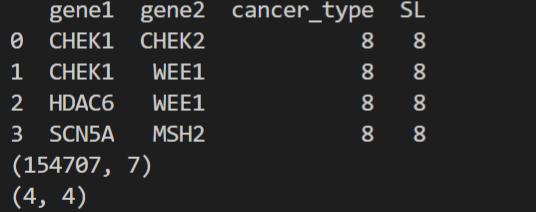

### Stratified Cross validation

1. 建议减少使用的cancer_type

   - 原因: 因为 leave combinations out 要求使用的 valid gene-gene pair 同时出现在所有的 cancer type 里, 而满足该条件的只有4个gene-gene pair

     

   - 解决方法1: 

     - 计算cancer_type出现的频率:  [('COAD', (91999, 4)), ('LAML', (20505, 4)), ('SKCM', (18719, 4)), ('CESC', (5440, 4)), ('LUAD', (5140, 4)), ('KIRC', (2576, 4)), ('BRCA', (2177, 4)), ('OV', (818, 4))]

   - 2: random cv

2. 5  fold: 比较模型
3. 10 fold: predict(1/10)
   
### suggestion
4. Attention-transfer
5. feature
6. graph conv: https://www.sciencedirect.com/science/article/pii/S200103701930368X

### next week

1. colab

2. graph conv: https://www.sciencedirect.com/science/article/pii/S200103701930368X

3. GCN: geneSL

   

### schedule

1. 12开题, 4月终期答辩